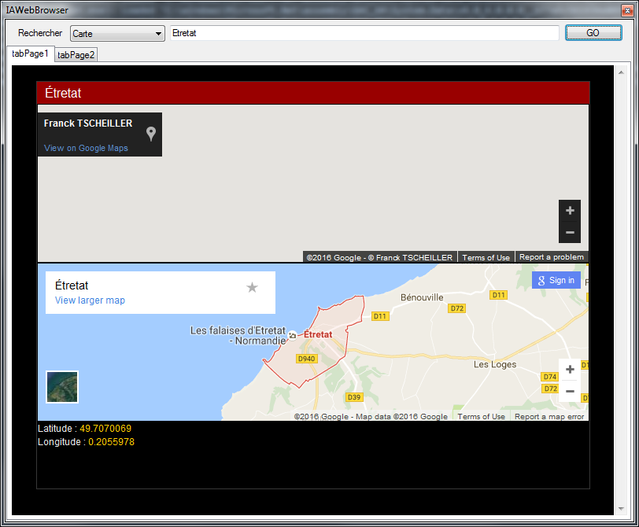

# Droid Web 

Parsing all sentenses with vocabulary and times. XML file with almost french words. You can add your own database to have your words.

 

# Usage

Format your .net object to be displayed on web.
For desmonstration, you can find here under the parsed object with a simple presentation.

# Example in demo

Web research for news articles

Web research for maps views

Web research for simple weather (first version, see the github project for a better weather, this is just a simple web research)

Web research recipe

Web research about people

